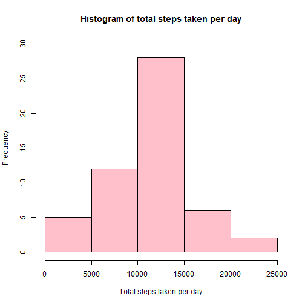
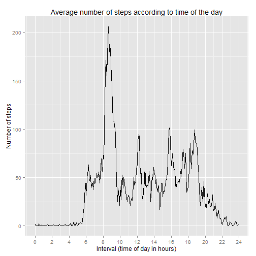
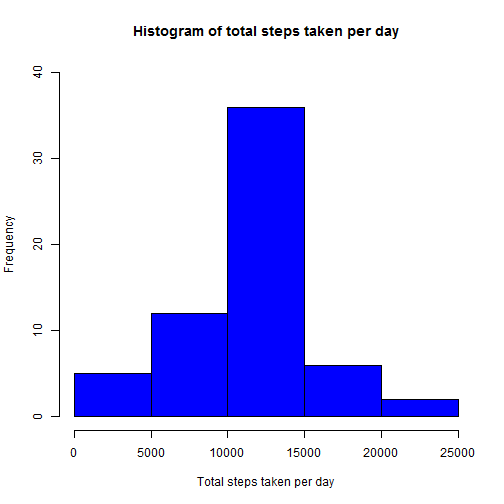
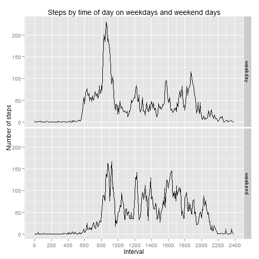

## Source of data

The data for this assignment came from a personal activity monitoring device
that collected data at 5 minute intervals during the day. The data covers the 
months of October and November, 2012 and measures the number of steps taken in 
each 5 minute interval.

The [data][1] was downloaded from the course web site. The comma-separated-value
(CSV) file contains three variables:

[1]: https://d396qusza40orc.cloudfront.net/repdata%2Fdata%2Factivity.zip
"Activity monitoring data[52K]"

* *steps*: Number of steps taken in the 5-minute interval (missing values are 
coded as NA)
* *date*: The date of the measurement in YYYY-MM-DD format
* *interval*: The 5-minute interval (time of day) at the end of which the measurement 
was taken

There are 17,568 observations in this dataset.

## Loading and preprocessing the data

Before loading the dataset, we checked that the files were in our working
directory. We checked three things:

1. if we had the zip file
2. if zip file had been unpacked
3. if the CSV file was present

Then we read the data from the CSV file into a R data frame, *moveData*. 


```r
zipDataFile <- "activity.zip"
fileName <- "activity.csv"

## Check that files exist
if (!file.exists(zipDataFile)) 
    stop("Zipped data file not present in working directory.")

if (file.exists(zipDataFile) && !file.exists(fileName)) {
    print("Unzipping data file.")
    unzip(zipDataFile)
}

if (!file.exists(fileName)) 
    stop("Data was not successfully unpacked. Please retry.")

## Read the data
moveData <- read.csv(fileName, stringsAsFactors=FALSE)
```

We needed to do some basic processing:

1. We converted the strings in the *date* column to dates
2. We added a column *decTime* that is the same as interval time but has minutes
recorded as a decimal (e.g. 8.45am = 8.75). This is to ensure that when plotting
time on the x-axis, it will scale properly.


```r
library(lubridate)
suppressMessages(library(dplyr))

## Convert dates
moveData$date <- ymd(moveData$date)

## Add decimal times
moveData <- mutate(moveData, 
                   decTime=(as.integer(moveData$interval/100) + 
                                (moveData$interval%%100)/60))
```

## What is the mean total number of steps taken per day?

First, we grouped and summarized the data using *dplyr* to find the total number of
steps per day. Then we made a histogram for the total number of steps per day.


```r
moveData <- group_by(moveData, date)
plotData <- summarize(moveData, Total = sum(steps)) ## na.rm is TRUE by default
hist(plotData$Total, main="Histogram of total steps taken per day", 
     xlab="Total steps taken per day", ylim = c(0,30), col = "pink")
```

 

Then we calculated the mean and median for the total number of steps per day.


```r
## as.character used to round off without using scientific notation
meanSteps <- as.character(round(mean(plotData$Total, na.rm=TRUE), 2))
medianSteps <- median(plotData$Total, na.rm=TRUE)
```

The mean number of steps per day is 10766.19 and the median number of steps
per day is 10765.

## What is the average daily activity pattern?

To see how the average number of steps changes by the time of day, we regrouped 
the dataset by the 5 minute interval of the day (in decimal form).

Then we summarized it and plotted it. 


```r
moveData <- group_by(moveData, decTime)
meanData <- summarize(moveData, average=mean(steps, na.rm=TRUE))

library(ggplot2)
g <- ggplot(data=meanData, aes(x=decTime, y=average)) + geom_line() + 
    ggtitle("Average number of steps according to time of the day") + 
    xlab("Interval (time of day in hours)") + ylab("Number of steps") + 
    scale_x_continuous(breaks=seq(0,24,2))

print(g)
```

 

We found the highest number of average steps by looking for the highest number in *meanData$average*. Then we looked up the matching interval.


```r
## Find the highest average number of steps 
maxAverage <- max(meanData$average)

## Find the corresponding interval of time
maxInterval <- meanData[meanData$average==maxAverage,"decTime"]
maxInterval <- maxInterval$decTime[1]

## Format it into a nice string for printing
hours <- as.integer(maxInterval)
minutes <- (maxInterval - hours)*60
maxInterval <- paste(hours,":",minutes, sep="")
maxAverage <- as.character(round(maxAverage, 2))
```

The 5 minute interval with the maximum number of average steps ended at 
8:35 (24 hour time), during which an average of 206.17 steps 
was taken.

## Imputing missing values

Since missing days (NA values) in the data may introduce bias into calculations 
or summaries, the data set was modified to deal with NA values.

First, we calculated and reported the total number of missing values in the dataset
(i.e. the total number of rows with NAs). Since the *date* and *interval* 
columns specify the date and time of the recording, we only needed to check the 
*steps* column.


```r
total <- sum(is.na(moveData$steps))
totalObs <- nrow(moveData)
```

The total number of missing values in the dataset was 2304 out of 
17568 observations.

Second, we devised a strategy for filling in all of the missing values. We 
decided to use the mean for that 5-minute interval because this would create
less distortion of how activity changes through the day.

Third, the filled in dataset was used to create a new dataset *completeData* 
that is equal to *moveData* but with the missing data filled in with the mean 
for each 5-minute interval.

The function *replaceNAsInterval* returns a filled in dataset when given the 
dataset *data* with missing values, and a dataset *subvals* with the mean
number of steps for each interval (in decimal form).


```r
replaceNAsInterval <- function(data, subvals) {
    for (i in 1:nrow(data)) {
        ## If it's NA
        if (is.na(data$steps[i])) {
            ## Check the time interval
            time <- data$decTime[i]
            ## Pull up the data frame containing the mean value for that time 
            ## interval
            subval <- subvals[subvals$decTime==time,]
            ## Put the mean value in the dataset
            data$steps[i] <- subval$average[1]
        }
        i <- i+1
    }
    ## Return the modified dataset
    data
}

## Replace the NAs in moveData and store the completed set in completeData
completeData <- replaceNAsInterval(moveData, meanData)
```

Fourth, we grouped and summarized the data to find the total number of steps per 
day. Then we made a histogram for the total number of steps per day.


```r
completeData <- group_by(completeData, date)
plotCompleteData <- summarize(completeData, Total = sum(as.numeric(steps)))
hist(plotCompleteData$Total, main="Histogram of total steps taken per day", 
     xlab="Total steps taken per day", ylim = c(0,40), col = "blue")
```

 

As can be seen, the result is that without missing values, some categories are 
higher than the estimates because all intervals on all 61 days have values.

The effect on the total number of steps for each day depends on whether values
are missing for whole days (e.g. 1 October), or only for certain intervals 
within some days. We worked this out by checking which dates have NAs, and how
many.


```r
moveData <- group_by(moveData, date)
summarize(moveData, sum(is.na(steps)))
```

```
## Source: local data frame [61 x 2]
## 
##          date sum(is.na(steps))
## 1  2012-10-01               288
## 2  2012-10-02                 0
## 3  2012-10-03                 0
## 4  2012-10-04                 0
## 5  2012-10-05                 0
## 6  2012-10-06                 0
## 7  2012-10-07                 0
## 8  2012-10-08               288
## 9  2012-10-09                 0
## 10 2012-10-10                 0
## 11 2012-10-11                 0
## 12 2012-10-12                 0
## 13 2012-10-13                 0
## 14 2012-10-14                 0
## 15 2012-10-15                 0
## 16 2012-10-16                 0
## 17 2012-10-17                 0
## 18 2012-10-18                 0
## 19 2012-10-19                 0
## 20 2012-10-20                 0
## 21 2012-10-21                 0
## 22 2012-10-22                 0
## 23 2012-10-23                 0
## 24 2012-10-24                 0
## 25 2012-10-25                 0
## 26 2012-10-26                 0
## 27 2012-10-27                 0
## 28 2012-10-28                 0
## 29 2012-10-29                 0
## 30 2012-10-30                 0
## 31 2012-10-31                 0
## 32 2012-11-01               288
## 33 2012-11-02                 0
## 34 2012-11-03                 0
## 35 2012-11-04               288
## 36 2012-11-05                 0
## 37 2012-11-06                 0
## 38 2012-11-07                 0
## 39 2012-11-08                 0
## 40 2012-11-09               288
## 41 2012-11-10               288
## 42 2012-11-11                 0
## 43 2012-11-12                 0
## 44 2012-11-13                 0
## 45 2012-11-14               288
## 46 2012-11-15                 0
## 47 2012-11-16                 0
## 48 2012-11-17                 0
## 49 2012-11-18                 0
## 50 2012-11-19                 0
## 51 2012-11-20                 0
## 52 2012-11-21                 0
## 53 2012-11-22                 0
## 54 2012-11-23                 0
## 55 2012-11-24                 0
## 56 2012-11-25                 0
## 57 2012-11-26                 0
## 58 2012-11-27                 0
## 59 2012-11-28                 0
## 60 2012-11-29                 0
## 61 2012-11-30               288
```

This showed us that there were 8 days where no measurements were taken. As a 
result, on those days, our strategy for filling in the data set would give us a 
total number of steps equal to the sum of the mean values for each interval. It
would not increase the total number of steps for any day that we had already
included in the first histogram. Therefore, since we know that the mean was
10766.19, the number of days on which the participant took 10000-15000 
steps would have increased by 8 days. The other days would have remained the 
same as the estimates.

Again we calculated the mean and median for the total number of steps per day.


```r
meanSteps <- as.character(round(mean(plotCompleteData$Total, na.rm=TRUE), 2))
medianSteps <- as.character(round(median(plotCompleteData$Total, na.rm=TRUE),2))
```

The mean number of steps per day is 10766.19 and the median number of steps
per day is 10766.19.

The number of days on which all values were missing has actually changed the 
median to the mean!

## Are there differences in activity patterns between weekdays and weekends?

The first thing we did was to work out the day of the week for every date. Then 
we created a new factor variable *daytype* to indicate whether a given day is a 
weekday or a weekend day.


```r
## Add the days of the week to the table
completeData <- mutate(completeData, weekday=weekdays(date))
completeData$daytype <- as.factor(ifelse(
                            completeData$weekday %in% c("Saturday", "Sunday"), 
                            "weekend", "weekday")) 
```

Then we grouped the data and summarized to get a dataset with the average number
of steps for each 5 minute interval on weekdays and on weekends.


```r
completeData <- group_by(completeData, daytype,decTime)
splitData <- summarize(completeData, average=mean(steps))

g <- ggplot(splitData, aes(x=decTime, y=average)) + geom_line() +
    facet_grid(daytype ~ .) + xlab("Interval") + ylab("Number of steps") +
    ggtitle(label = "Steps by time of day on weekdays and weekend days") +
    scale_x_continuous( breaks = seq(0,24,2), labels = seq(0,2400,200) )

print(g)
```

 

In both cases, there is very little movement between 10pm and 6 pm. This is logical since most people would be asleep.
 
 On weekdays, we see that there is early activity from 6 am, then a distinct spike of activity between 8-9 am, and a smaller spike between 6-7 pm. There are small spikes around 12 pm and just before 4 pm, which may reflect lunch and getting a coffee. This makes sense in the context of a work day.

On weekends, we can see that there are less distinct spikes - activity doesn't 
usually start until 8am - and activity is spread out more evenly through the 
day. There is still highest activity between 8-10 am, perhaps reflecting 
breakfast or exercise. Activity also lasted later into the night (e.g. between 
8-9pm).
